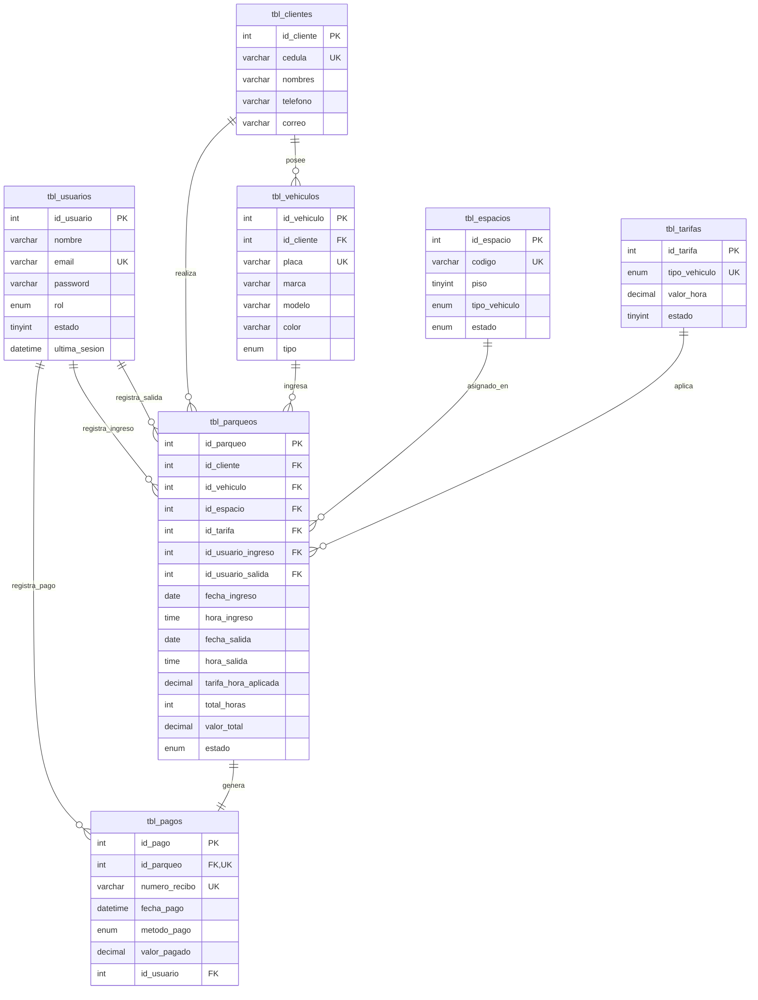

# Informe de Entrega - SMARTPARK

## 1. Descripción del proyecto

SMARTPARK es un sistema de gestión de parqueadero que permite:
- Registrar clientes y vehículos.
- Reservar espacios por tipo de vehículo.
- Controlar ingresos y salidas.
- Generar pagos y facturas.
- Enviar notificaciones por correo electrónico.

El objetivo es automatizar la operación de un parqueadero, gestionar reservas y cobros, y mantener un historial seguro de transacciones.

## 2. Tecnología utilizada

- Backend: PHP 8+ con MySQL/MariaDB.
- Frontend: HTML, CSS, JavaScript.
- Librerías: PHPMailer para correo, Bootstrap / custom CSS para interfaz.
- Base de datos: MySQL con motor InnoDB.

## 3. Diagrama entidad-relación

## 4. Base de Datos

### 4.1 Tablas principales

El sistema tiene al menos 7 tablas relacionadas:
- `tbl_usuarios`
- `tbl_clientes`
- `tbl_vehiculos`
- `tbl_espacios`
- `tbl_tarifas`
- `tbl_parqueos`
- `tbl_pagos`

Todas las tablas están relacionadas por claves foráneas para mantener integridad referencial.

### 4.2 Procedimientos y funciones

Se incluye el archivo SQL adicional `BD/procedimientos_y_transacciones.sql` con:
- `fn_calcular_total_parqueo(...)` como función de utilidad.
- `sp_registrar_pago(...)` como procedimiento almacenado.

### 4.3 Triggers

Los triggers implementados en `BD/smartpark.sql` son:
- `trg_parqueo_validar_ingreso`: valida que el vehículo no tenga reserva o ingreso activo antes de registrar un nuevo parqueo.
- `trg_parqueo_ingreso_ocupa_espacio`: actualiza el estado del espacio cuando un parqueo ingresa.
- `trg_pago_libera_espacio`: libera el espacio asociado cuando se registra el pago.

### 4.4 Transacciones

El sistema utiliza transacciones en la lógica de negocio con `START TRANSACTION`, `COMMIT` y `ROLLBACK` para operaciones críticas de reserva y pago.

### 4.5 Control de concurrencia

La aplicación usa bloqueo de fila con `SELECT ... FOR UPDATE` al asignar espacios y verificar disponibilidad, evitando condiciones de carrera durante reservaciones.

## 5. Interfaz

### 5.1 Funcionalidades implementadas

El sistema permite:
- Registro de clientes y vehículos.
- Consulta y edición de clientes, vehículos, reservas y pagos.
- Creación y cancelación de reservas.
- Registro de ingresos, salidas y facturación.
- Búsqueda por cliente, placa y código de reserva.

### 5.2 CRUD y validaciones

Se implementan formularios que realizan:
- Validación de campos obligatorios.
- Validación de correo y datos de contacto.
- Uso de consultas preparadas (`mysqli_prepare`) para evitar inyección SQL.
- Protección de acceso a páginas con sesiones activas.

## 6. Seguridad

### 6.1 Roles y permisos

La tabla `tbl_usuarios` define roles de usuario.
Dependiendo del rol, la aplicación restringe el acceso a funciones de administración, caja y control.

### 6.2 Protección contra inyección SQL

La aplicación usa consultas preparadas en PHP con `mysqli_prepare` y `mysqli_stmt_bind_param` en múltiples lugares, incluyendo:
- Login (`acciones/login/acciones_login.php`)
- Reservas (`ReservarParqueadero.php`)
- Consulta de reservas (`ConsultarReserva.php`)
- Búsqueda de clientes (`acciones/buscar_cliente.php`)

### 6.3 Manejo seguro de contraseñas

Las contraseñas de usuario se almacenan con hash seguro usando `password_hash(..., PASSWORD_BCRYPT)`.
El inicio de sesión valida con `password_verify(...)`.

## 7. Despliegue

### 7.1 Estado de despliegue

- URL pública del sistema: ____________________________
- Hosting: InfinityFree / otro proveedor.
- Base de datos: MySQL / MariaDB.

### 7.2 Instrucciones de despliegue

1. Importar `BD/smartpark.sql` o `BD/smartpark_infinityfree.sql` según el hosting.
2. Configurar `config/config.php` con credenciales del servidor.
3. Configurar `emails/mailer_config.php` con SMTP externo.
4. Subir código al hosting.

## 8. Documentación adjunta

Archivos incluidos en la entrega:
- Código fuente completo.
- Scripts SQL: `BD/smartpark.sql`, `BD/smartpark_infinityfree.sql`, `BD/procedimientos_y_transacciones.sql`.
- Informe en PDF (convertir este documento a PDF).
- Capturas de pantalla de la interfaz.

## 9. Cumplimiento de temas del curso

### 9.1 Base de datos
- Modelo relacional con 7 tablas.
- Integridad referencial con claves foráneas.
- Triggers para auditoría y validación de negocios.
- Procedimientos y funciones almacenados.
- Control de concurrencia mediante bloqueos y transacciones.

### 9.2 Aplicación
- Interfaz web con operaciones CRUD.
- Validaciones en frontend y backend.
- SQL seguro con consultas preparadas.
- Manejo de sesiones y hashing de contraseñas.

## 10. Conclusión

SMARTPARK es una solución completa para administrar un parqueadero con registro de clientes, vehículos, reservas y pagos.
El proyecto está listo para su entrega con código, scripts y documentación que muestran la arquitectura, la seguridad y el despliegue.
