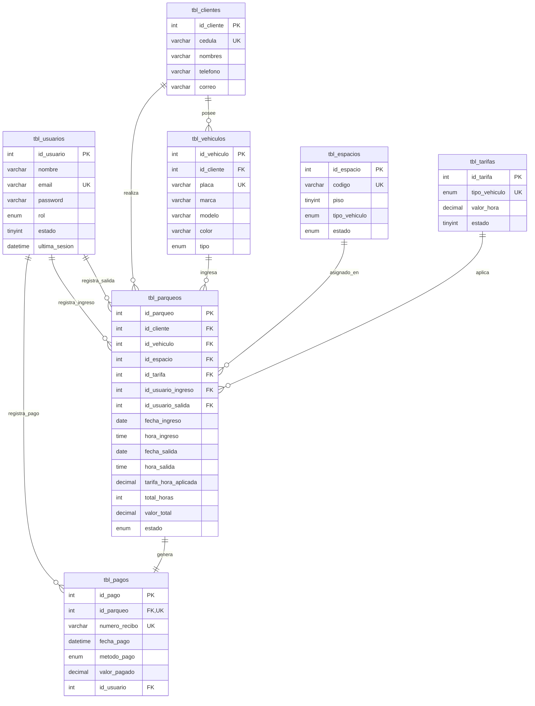

# Diagrama Entidad-Relacion SMARTPARK

```mermaid
erDiagram
    tbl_usuarios ||--o{ tbl_parqueos : registra_ingreso
    tbl_usuarios ||--o{ tbl_parqueos : registra_salida
    tbl_usuarios ||--o{ tbl_pagos : registra_pago
    tbl_clientes ||--o{ tbl_vehiculos : posee
    tbl_clientes ||--o{ tbl_parqueos : realiza
    tbl_vehiculos ||--o{ tbl_parqueos : ingresa
    tbl_espacios ||--o{ tbl_parqueos : asignado_en
    tbl_tarifas ||--o{ tbl_parqueos : aplica
    tbl_parqueos ||--|| tbl_pagos : genera

    tbl_usuarios {
        int id_usuario PK
        varchar nombre
        varchar email UK
        varchar password
        enum rol
        tinyint estado
        datetime ultima_sesion
    }

    tbl_clientes {
        int id_cliente PK
        varchar cedula UK
        varchar nombres
        varchar telefono
        varchar correo
    }

    tbl_vehiculos {
        int id_vehiculo PK
        int id_cliente FK
        varchar placa UK
        varchar marca
        varchar modelo
        varchar color
        enum tipo
    }

    tbl_espacios {
        int id_espacio PK
        varchar codigo UK
        tinyint piso
        enum tipo_vehiculo
        enum estado
    }

    tbl_tarifas {
        int id_tarifa PK
        enum tipo_vehiculo UK
        decimal valor_hora
        tinyint estado
    }

    tbl_parqueos {
        int id_parqueo PK
        int id_cliente FK
        int id_vehiculo FK
        int id_espacio FK
        int id_tarifa FK
        int id_usuario_ingreso FK
        int id_usuario_salida FK
        date fecha_ingreso
        time hora_ingreso
        date fecha_salida
        time hora_salida
        decimal tarifa_hora_aplicada
        int total_horas
        decimal valor_total
        enum estado
    }

    tbl_pagos {
        int id_pago PK
        int id_parqueo FK,UK
        varchar numero_recibo UK
        datetime fecha_pago
        enum metodo_pago
        decimal valor_pagado
        int id_usuario FK
    }
```
